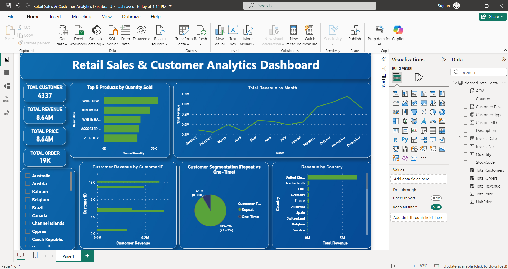

# 🛒 Retail Sales & Customer Analytics

## 📌 Overview
This project presents an end-to-end data analytics workflow to analyse retail transaction data and uncover insights into sales performance, customer behaviour, and revenue trends.

The analysis helps identify key business drivers and provides actionable recommendations for improving customer retention, product performance, and overall revenue growth.

---

## 🎯 Objectives
- Analyse overall revenue and sales trends
- Identify top-performing products
- Understand customer purchasing behaviour
- Segment customers into repeat and one-time buyers
- Evaluate geographic performance
- Provide actionable business insights and recommendations

---

## 🛠 Tools & Technologies
- **Python** (Pandas, NumPy) → Data cleaning & preprocessing  
- **PostgreSQL** → Data storage & analysis  
- **Power BI** → Data visualization & dashboard  

---

## 📂 Dataset
The dataset used in this project is the **Online Retail Dataset** from the UCI Machine Learning Repository.

🔗 https://archive.ics.uci.edu/dataset/352/online+retail

> Note: The dataset is not included in this repository due to file size limitations.

---

## 🧹 Data Cleaning (Python)
- Removed missing `CustomerID` values  
- Filtered out negative and zero quantities (returns)  
- Removed invalid pricing values  
- Converted date columns to proper format  
- Created `TotalPrice` column for revenue calculation  
- Checked for duplicates and validated data quality  

---

## 🗄 SQL Analysis (PostgreSQL)
Performed business-driven analysis using SQL:
- Total Revenue Calculation  
- Revenue by Country  
- Top Products by Sales & Revenue  
- Top Customers by Revenue  
- Monthly Revenue Trends  
- Customer Segmentation (Repeat vs One-Time)  
- RFM Analysis (Recency, Frequency, Monetary)  
- Customer Lifetime Value (CLV)  

---

## 📊 Power BI Dashboard

### 🔹 Key Metrics
- Total Revenue  
- Total Orders  
- Total Customers  
- Average Order Value (AOV)  

### 🔹 Visualizations
- Monthly Revenue Trend  
- Top Products by Quantity  
- Revenue by Country  
- Customer Segmentation (Repeat vs One-Time)  
- Top Customers Contribution  

📸 **Dashboard Preview**  

---

## 🔍 Key Insights

- Revenue is driven by a small number of products and customers  
- Sales show noticeable fluctuations, indicating seasonality  
- A large proportion of customers are one-time buyers  
- Revenue is concentrated in a few geographic regions  
- High-value customers contribute significantly to total revenue  

---

## 💡 Business Recommendations

- Improve customer retention through loyalty programs  
- Focus on top-performing products for inventory optimisation  
- Target high-value customers with personalised strategies  
- Expand into underperforming geographic regions  
- Leverage seasonal trends for marketing and promotions  

---

## 📈 Conclusion

The analysis reveals that revenue is concentrated among a limited set of products and customers, with clear opportunities to improve customer retention and expand market reach. By focusing on high-value customers and optimising product strategies, the business can achieve sustainable growth.

---

## 📁 Project Structure
